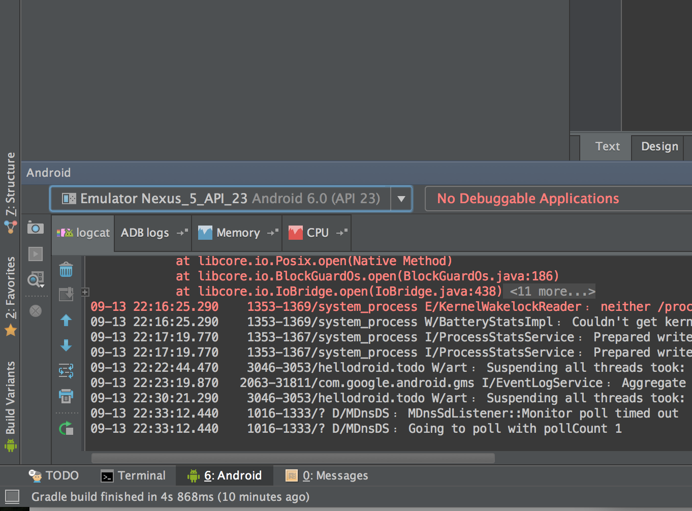
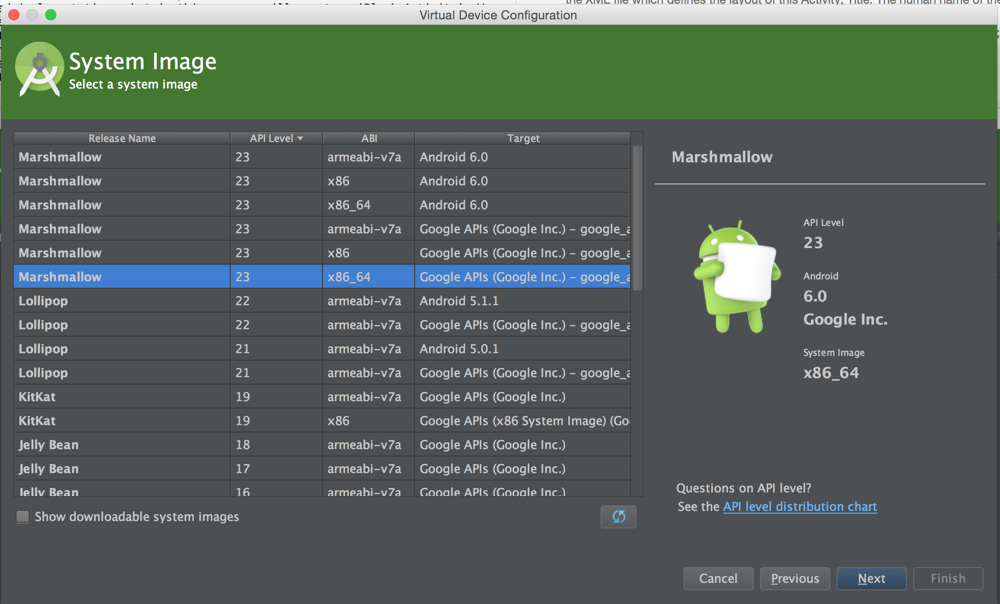
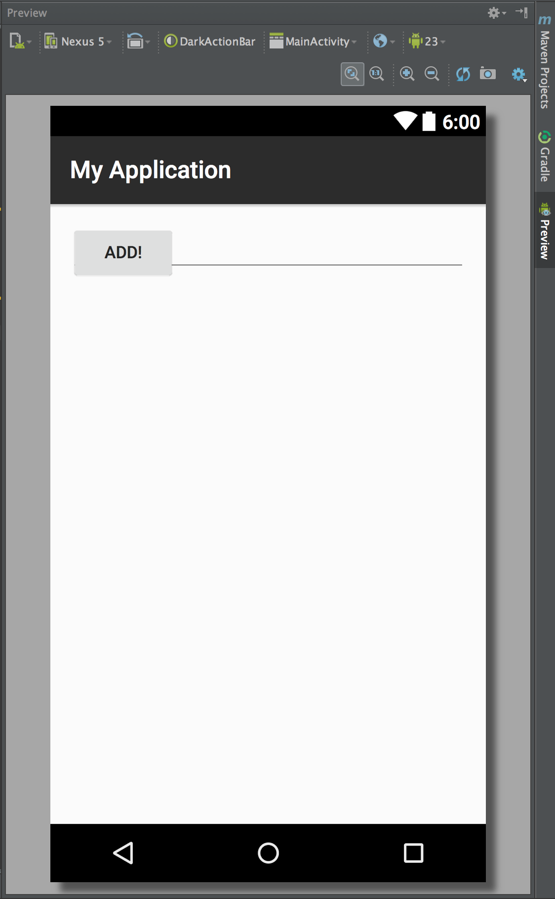
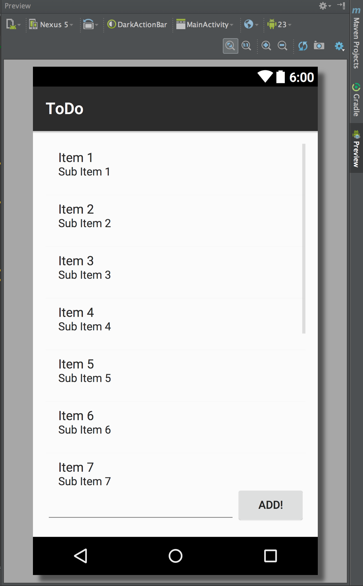
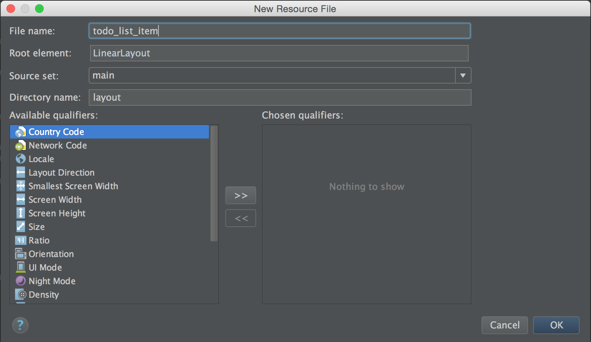
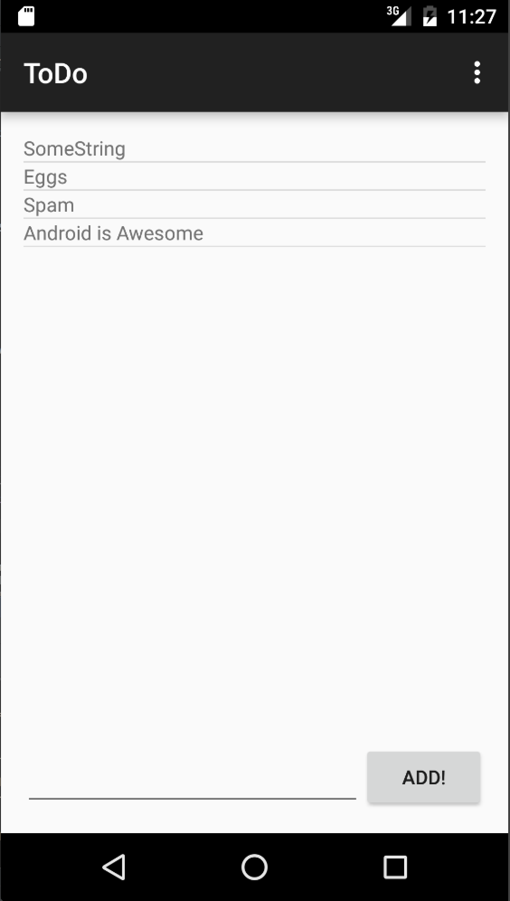
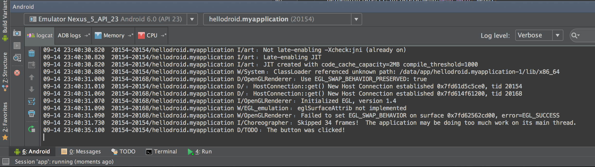
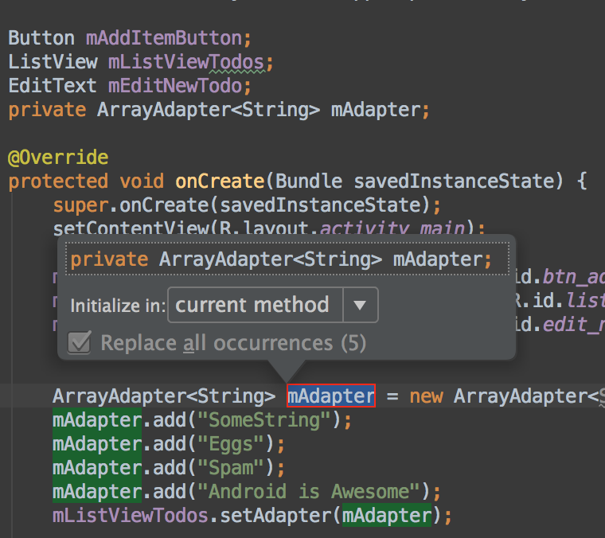

#Get Started with Android

##What will you learn?
You will learn the basics of Android development by creating a basic ToDo List app using Android Studio and native Android UI elements. Including:

 - Activities and Lifecycle
 - Layouts
 - Lists and Adapters
 - Buttons and Listeners
 - Running and debugging your app

##Prerequisites
 - OOP concepts
 - Java [JRE](http://java.com/en/download/) installed
 - [JDK 7](http://www.oracle.com/technetwork/java/javase/downloads/jdk7-downloads-1880260.html) installed
 - Android Studio, SDK and Emulator
 	[http://developer.android.com/sdk/index.html](http://developer.android.com/sdk/index.html)
  	 NOTE: Make sure you open up Android Studio before the workshop, as there is further set-up within the application, which may take some time to download.

#Lets get Started!

##Create a new Project

1. Open Android Studio select 'Start a new Android Studio Project', give it a name and choose where you want to save it. Package names are conventionally the reverse of your website domain (if you have one) in this case we could put `io.codebar`, but you can use anything you want.
2. Next we'll be asked what kind of device we want our app to run on, 'Phone and Tablet' should be selected by default, and here we select the minimum version of Android we will require to run our device on. Lets choose 4.1 Jelly Bean, because life is just better when you target Jelly Bean and up.
3. Now we will be asked to add an `Activity`. Our first UI screen. We can choose from a load of pre-baked implementations, but in this case we will create a 'Blank Activity'.
4. We now provide 3 related names: Activity Name: the name of our Java class file defining our activity, Layout Name: the name of the XML file which defines the layout of this Activity. Title: The human name of the app to show at the top of the Activity when the app is running. Give the Title whatever name you want and leave the others. 'ToDo' might be a good one ;)
4. Hit 'Finish' and you've just created your first Android project!

## Run the project
So, Android Studio has gone ahead and given us 'Hello, World' to get us started. Let's run it first, then see what it is made up of.
So, we have two options here:

- If you have an Android phone, running Jelly Bean 4.1 and up, happy days! You can run it on your phone! Follow the steps below to get started.
- If you don't have an Android phone, sad times :(, but don't worry, we can use the emulator to run it on your computer. Skip to the emulator section to see how.

###Running the app on your phone
There are a few steps involved to get the app running on your phone. First we need to enable Developer Mode on your phone.

1. Open your phone's settings menu
2. Find the 'About phone' section
3. Find the entry that says 'Build number'
4. Tap it multiple times until it starts a countdown
5. Tap until it says: "You're now a Developer!"
6. Go back to your phone's settings screen, you should see a new section called 'Developer Options' lets go in there!
7. Scroll down and make sure 'USB debugging' is selected
8. Plug your phone into your computer
9. In Android Studio open up the 'Android' toolbar at the bottom of the window and make sure the 'logcat' tab is open. In the dropdown box, you should see your phone and all of the log messages from all the currently running apps you have will now be streaming in the logcat window!

	
10. Under the 'Run' Menu in Android Studio, select `Run 'app'`, this should install the app and run it on your phone!

###Running the app in the Emulator
Lets get an AVD (Android Virtual Device) up and running so you can test your app.

1. Under Tools - > Android -> 'AVD Manager'
2. Select Create Virtual Device from the bottom left
3. Lets have a nice Nexus 5 to play with, select 'Nexus 5' from the phone category (confusingly, there are two, choose the one which says 'xxhdpi' under density)
4. Now lets choose our system Image, which is what version of Android we want to run. Select `Marshmallow, API - 23, ABI - x86_64, Target - Google APIs`. Make sure you install the Intel HAXM when prompted, otherwise the emulator will be woefully slow and you will hate yourself for not doing it. If the `x86_64` is not shown, check the 'Show downloadable system images' box and download it. The `armeabi` is just incredibly slow and will take the entire evening to boot.

	
5. Click next and give your AVD (Android Virtual Device) a name, check the 'Use host GPU' option and click 'finish'
6. Now start your emulator by clicking the play button in the right hand column of your new AVD. If it doesn't start properly make sure to close any other VMs you might be running.
7. Under the 'Run' Menu in Android Studio, select `Run 'app'`, this should install your app and run it on your new AVD!

###Our first app
Behold! We've run our first Android app! But it's not terrible useful right now! We want to make it do something more exciting. But first lets have a look at what we have been given as a starting point. Back in AS there should be two tabs open in the editor, one Java file, and one XML file.

First selected the XML file and select the Text tab, you should see something like this:

	<RelativeLayout xmlns:android="http://schemas.android.com/apk/res/android"
    	xmlns:tools="http://schemas.android.com/tools"
    	android:layout_width="match_parent"
    	android:layout_height="match_parent"
    	android:paddingLeft="@dimen/activity_horizontal_margin"
    	android:paddingRight="@dimen/activity_horizontal_margin"
    	android:paddingTop="@dimen/activity_vertical_margin"
    	android:paddingBottom="@dimen/activity_vertical_margin" tools:context=".MainActivity">

    	<TextView android:text="@string/hello_world" android:layout_width="wrap_content"
        	android:layout_height="wrap_content" />

	</RelativeLayout>

Layouts in Android are written in XML and, much like HTML for web, there are various tags and attributes. Each of these tags represents a `View`, which will make up what you will see on your app's screen. Together, all of these Views make up whats known as the **Layout Hierarchy**. It's a hierarchy, because there can be views inside other views, like in this example a `TextView` is inside a `RelativeLayout`.

There are hundreds of different kinds of Views which you can use in Android. Including buttons, images and editable text fields, and also Google Maps even your own custom views. Most of these views will represent some visible screen content, like an image or a label or a list. Others, though, will help you define the structure of your view, i.e. how it is laid out on the screen - which view is at the top, which is at the bottom and so on - these rules can be as simple like, everything one after the other from top to bottom, or it can be more complex. Nesting these structural elements allows you to control exactly how everythig is laid out in the View Hierarchy. At minimum, most elements require that you at least specify its hieght and width on the screen using the `android:layout_width` and `android:layout_height` attributes.

In our example, we have two Views. One containing structural View - the `RelativeLayout` - which is filling the screen by having it's width and height match it's parent - it's parent in this case being the screen. Inside this we have a `TextView`, with it's width and height set to stretch to wrap whatever content it contains, it also has a reference to the string "Hello, World!" in it, rather than having the string hardcoded. We can hardcode this value here, but generally, we don't keep raw strings in our layout XMLs for 2 main reasons:

1. It clutters out layout, especially if there is a big blob of text
2. It's better for localisation. When our app goes global and we support different languages this same key can be used across different language files to fill this `TextView` with the correct text for the current language.

The same is true for the padding values on the `RelativeLayout` these `dimen` values may be different on devices with different pixel densties, screen sizes, orientations. They can also be hardcoded though. To inspect their actual values CMD click on the text after `@dimen/`

We will be editing this file in order to define the layout of our ToDo app. But first lets take a look at the associated Java code (with imports omitted):

	public class MainActivity extends AppCompatActivity {

	    @Override
	    protected void onCreate(Bundle savedInstanceState) {
	        super.onCreate(savedInstanceState);
	        setContentView(R.layout.activity_main);
	    }

	    @Override
	    public boolean onCreateOptionsMenu(Menu menu) {
	        // Inflate the menu; this adds items to the action bar if it is present.
	        getMenuInflater().inflate(R.menu.menu_main, menu);
	        return true;
	    }

	    @Override
	    public boolean onOptionsItemSelected(MenuItem item) {
	        // Handle action bar item clicks here. The action bar will
	        // automatically handle clicks on the Home/Up button, so long
	        // as you specify a parent activity in AndroidManifest.xml.
	        int id = item.getItemId();

	        //noinspection SimplifiableIfStatement
	        if (id == R.id.action_settings) {
	            return true;
	        }

	        return super.onOptionsItemSelected(item);
	    }
	}

This is our Activity class, an Activity can be thought of as representing the controlling code for one screen of content. This is the code that binds all of the views and their behaviours together and can perform or start other tasks like fetching content from a server, or loading some saved content.

We also have 3 functions that have been generated, the first and most important of these is the `onCreate` function. This is one of many 'lifecycle callback' functions and this will be called when the activity is created by the system. There are multiple lifecycle callbacks which can be implemented by you to define what to do when for example the user closes the app, or resumes the app, or presses the back button etc. This can get pretty complicated here is the basic lifecycle of an activity for reference:

That's a lot of lifecycle! Thankfully, today we're only really focussing on onCreate, but if you continue with Android, it's important to learn these callbacks and their order.

At the moment our `onCreate` is doing one thing, it's setting the content view -  that is the screen content - to be the content of our XML file. As you can see this isn't pointing at a filename, but instead using a static referece from a generated class called `R`. In Android, the generated `R` class is pretty important, it's the main way to get references to all of our XML files and their content from inside Java code. `R.layout` will contain references to our layout files, `R.id` to get specfic Views by any Id them we give, `R.string` for strings (Like "Hello, World", or the name of the app), `R.drawable` for images and other xml defined dynamic drawable elements and so on.

The other two functions are there to provide the 'three dots' menu options, we won't be touching these today.

Now lets get editing!

##Changing our layout

Let's go back to our layout XML and modify it so we can use it for our ToDo list app. We will need 3 elements for our app, a list showing existing ToDos, an editable text area to type a new item, and a button to add the new item to the list.

1. First, lets get rid of that `TextView`. In it's place, we will put a `ListView` instead, set it's attributes so that it's width matches its parent and it's height also matches it parent - the `RelativeLayout`.
2. After the `ListView` as the next child of the `RelativeLayout` create a new `EditText` element. This should also match it's parent in width, but set it's height to `wrap_content`.
3. Lastly add the `Button` element. We want this to `wrap_content` for width and height, so that it only occupies the space that it needs to show all of it's text. Set it's text attribute `android:text` to be "Add" or "Create" or whatever you want. You can hard code this for now, but refactor it to pull the value out into the strings file later.

We should now have a Layout Hierarchy of 3 Views as children of the Relative Layout.

Lets look at the preview window and see what we have:

Hmmmm. That's not great, everything is bunched up in the top left corner. That's because we are using a `RelativeLayout` as our container element. A `RelativeLayout` is a structural View that allows it's child elements to position themselves relative to their parent and/or other child elements using rules. So lets add a few rules in so we can get this looking the way we want. In simple terms we want:

1. The `Button` on the bottom right of the screen, below the list
2. The `EditText` aligned to the bottom of the screen
1. The `EditText` below the list
2. The `EditText` to the left of the `Button`

Lets add these in:

1. In our `EditText` and `Button` add an attribute `android:layout_alignParentBottom="true"`
2. In the `Button` add `android:layout_alignParentRight="true"`

But we have a problem now. We want to set the remaining rules relative to each other, but first we need a way for one element to reference another. For this we use IDs. Sadly, this isn't just `id=bla`, it's a bit more verbose. Lets give our button an id `btn_add_todo_item` by adding the following attribute to the button: `android:id="@+id/btn_add_todo_item"`, now give the id `edit_new_item` to our `EditText` and `list_todos` to our `ListView`. Naming is always important, so a longer, descriptive name is always better than say `i` or `x`.

(N.B. These ids generate the appropriate values in the `R` class, so we should now have access to our button via `R.id.btn_add_todo_item` in our Java class, this will come in handy later!)

Now that all our view elements have ids, we can finish our layout rules.

1. Add `android:layout_toLeftOf="@+id/btn_add_todo_item"` to our `EditText`
2. Add `android:layout_above="@+id/btn_add_todo_item"` to our `ListView`

Lets have another look at our Preview:

Looking good!

Now that our layouts are done, lets write some actual code and give it some behaviour in our `Activity` Java class.

##Code!

Lets think first about what we want to achieve in terms of code. Essentially, we want some array of Strings - contaning our to do list items - to display in our `ListView`. We also want to be able to add to this array by allowing the user to type a new item in the `EditText` and clicking our `Button` to save it to the array, clearing the `EditText` in the process, ready for the next item.

In Android, when we are dealing with an array of values that we wish to display we need to provide an `Adapter` class which will hold the array contents and translate the array elements to Views on-screen. We will have to create an `Adapter` class which will hold all of our todos, and the code necessary to wire up each item in the `ListView`.

Let's get a reference in our code to the elements in our layout first.

1. Create an instance variable to hold each of the view elements inside the Activity.
	
		public class MainActivity extends AppCompatActivity {

    		Button addItemButton;
    		ListView listViewTodos;
    		EditText editNewTodo;

	When you first type `Button`, `ListView` or some other type that is new to the class, you need to import it. Android Studio probably highlighted these words in red and suggested you press alt-Enter. It’s red, because the class wasn’t imported, but alt-enter does the recommended fix and imports the class. Pretty neat.
	
	
1. Inside our onCreate function we will provide values to these variables by getting references to our XML views using the `R` class. E.g. for the button:

        	addItemButton = (Button) findViewById(R.id.btn_add_todo_item);

1. Do the same for the `ListView` and the `EditText`. 
	
	The type value in the braces in front of `findViewById` is called a typecast in Java, which forces the return value of `findViewById` to the specified type. If you have not come across typecasting before, note we can only cast down from a supertype, `findViewById` returns a `View` which is a superclass of `Button`, so we can cast from a `View` to a `Button`. We couldn't, for example, cast the result of `findViewById` to a `String`, since `String` doesn't inherit from `View`.

4. Now we will create an `Adapter` to hold our todo items and apply it to our `ListView`. When we create adapters we normally create whole new classes and override some required methods. However, in our case displaying an array of items as only strings is such a common use case that a prebuilt adapter already exists called `ArrayAdapter`, if we wanted to also display an image for each item or anything more complex than a single string, we would need to create our own Adapter class. All we need to do is tell it what each item will look like and the id of the `TextView` in which to put the text representing an item. We should use this as it will save us some time. But first we need to create those resources.
	
	So lets go and create a new layout resource which defines how each list element will look. In the Project Explorer, browse to the layout folder under the res folder. Right click on the folder and create a new layout resource file called `todo_list_item`.

This will have created another XML file for us (Yay!) with a root element of the `LinearLayout` variety. `LinearLayout` is slightly easier than `RelativeLayout`. It simply lays it's child Views out in-order, either horizontally or vertically.

So this view will represent what each list item will look like. But for us, we simply want a `TextView` to hold our todo item String. Let's use what we learned from our previous XML experience and go ahead and create a `TextView` inside the LinearLayout, which matches it's parent in width and wraps in height, then give it an ID of `@+id/txt_todo_item`.

	
Now back in our Activity we can create our Adapter, inside onCreateView add:
	
		ArrayAdapter<String> adapter = new ArrayAdapter<String>(this, R.layout.todo_list_item, R.id.txt_todo_item);
		
	
The parameters we provided were a `Context` which represents the current `Activity`, the layout which defined our list item look and the id for the `TextView` inside that layout to hold our todo String, which you defined above. 

Here our generic type is defined inside the angle brackets. The awesome thing about Generics is that it works... generically. This Adapter only had to be written once, but will work with any type we give it, including a custom type of our own!
	
	
5. Now, after this, lets set our `ListView` to use our adapter

			mListViewTodos.setAdapter(adapter);
			
6. We've done quite a lot so far, so lets add some dummy values and do a test run. Add some dummy values to the adapter using `adapter.add("someString");` you can add multiple items by repeating this line
 a few times, just make sure you call `setAdapter(adapter)` last. Then run the project!
 
 
 	

	Nearly there!
	
###Push the Button

With the `ListView` working, the last thing to do is to accept input from the `EditText` and get it to add to our adapter. To do this we need to add a `Listener` to the `Button` to respond to click/tap events.

1. 	In onCreate() lets add a listener to our `Button`

		mAddItemButton.setOnClickListener(new View.OnClickListener() {
            @Override
            public void onClick(View v) {
                
            }
        });
        

	If you follow the AutoComplete, Android Studio can write most of this for you. Boilerplate like this and `findViewById` can get tedious, and there are libraries out there that help to cut it down.
	
	Now we have an empty button listener. This function will run whenever we click on our button. Let's get it to log out something so we can see it working. inside the `onClick` function put:
	
			Log.d("TODO", "The button was clicked!");
			
	Now run the project, open the Android toolbar at the bottom of Android Studio and select the Logcat tab and click the button.
	
	
	
	If you can see the text in logcat, then your button is working!
	
2. Lets grab the current text from the `EditText` and add it to the adapter inside this function. But first, we need to do one thing. So that we can access our adapter without making it `final` (immutable/unchangable) we need to change it so that it is an instance variable of the class, rather than a local variable inside `onCreate`. But don't go copy-pasting yet, Android Studio has us covered. 
	1. Go to the definition of adapter and right click the variable name.
	2. Select Refactor -> Extract -> Field (note the keyboard shortcut!) and hit return to accept the name
	3. Android Studio has done everything for us, including renaming the variable so it has a prefixed `m` since it's now an instance variable! (If it hasn't prefixed the `m`, the code style is probably not selected in the IDE settings, no big deal; Right click the variable name, Refactor -> Rename and it will rename all occurences)
	
	
	
3. Now, lets finish this. Grab the text from the `EditText` and add it to the adapter. Inside `onClick` for the `Button` add:

			String todo = mEditNewTodo.getText().toString();
            mAdapter.add(todo);
            mAdapter.notifyDataSetChanged();

	The `notifyDataSetChanged()` function tells the adapter that it's content has changed, and it needs to refresh the `ListView` to show any new values.
	
4. Run the app! (feel free to get rid of the hard coded dummy values)
5. One last nice to have is to clear the `EditText` after we have added the new item. After `notifyDataSetChanged()` add

		mEditNewTodo.setText("");
		
6. I think you'll agree that our onCreate function is getting a bit bloated. Lets do some housekeeping and trim it down a bit. Let's pull all the `findViewById` calls into a function called `bindViews` but rather than wasting time copy-pasting, lets use the power of the IDE to clean this up for us. 
	7. Highlight the three lines containing `findViewById` right click on the selected text and choose Refactor -> Extract -> Method. Give it the name `bindViews` and hit return. BOOM! AS has pulled those lines into a function and put the call to that function in their place!
	8. The click listener assigner is looking a bit ugly as well. Right click on the `new View.OnClickListener` select 'Refactor' -> 'Convert anonymous to inner', and give it a name. That's neatened things up with very little effort from us!
		
6. We're done! We created a blank Activity in Android Studio, built our layouts in XML, wired it up to our Java code and ran it on our phone! (or emulator)

##Extra Credit

2. Add a text hint (placeholder text) to the `EditText` (XML)

4. Add validation to our button `onClick` so that we don't add blank todo items. (Java)

3. Add an `onItemLongClickListener` to the `ListView` and make it remove the item that was long pressed on. (Java)

1. Make each list view item a bit prettier. Change the text size? Change the text colour? Add some padding? When adjusting sizes, specify font sizes in `sp` and view sizes and distances in `dp` instead of `px` or `em`. `sp` and `dp` are independant of pixel density and so scales appropriately with different screen sizes and pixel densities. (`dp` - formerly `dip` - means "density independant pixels") (XML)

##Further Resources

 - Android Developer Docs - [http://developer.android.com](http://developer.android.com)
 - Android Developers on YouTube [https://www.youtube.com/user/androiddevelopers](https://www.youtube.com/user/androiddevelopers)
 - AndroidChat Slack channel - [http://androidchat.co/](http://androidchat.co/)
 - Fragmented Podcast - An awesome Android Developer Podcast - [http://fragmentedpodcast.com/](http://fragmentedpodcast.com/)
 - Square - These guys build the best Android libraries. Period. [https://github.com/square](https://github.com/square)
 - Android Design Patterns - [http://www.androiddesignpatterns.com](http://www.androiddesignpatterns.com/)
 - Android Arsenal - a portal for finding libraries tools and apps related to android dev [https://android-arsenal.com/](https://android-arsenal.com/)
 - Android Weekly - a weekly email newsletter packed with all things Android [http://androidweekly.net/](http://androidweekly.net/)
 - Robolectric - a fast test framework to run Android tests for TDD - [http://robolectric.org/](http://robolectric.org/)
 - Espresso Unit testing library - [https://developer.android.com/tools/testing-support-library/index.html#Espresso](https://developer.android.com/tools/testing-support-library/index.html#Espresso)

